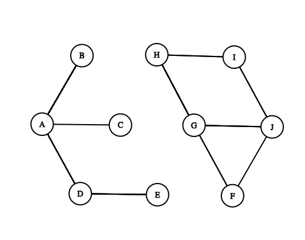

# Test path in a given graph using GoogleTest. 
## Problem:
Test if path (edge) exists in a given graph. Nodes are locations and edges are paths that connect those locations. 

`Location argument constraints`: only alpha characters and white spaces allowed, case insensitive. No empty strings allowed. The length of the argument must be in range [1, 163]. 

`Test fixture`: locations and paths for the test data are presented as an undirected graph that contains 2 disconnected subgraphs. 


Pic. 1 - Test Data

____
## Tasks:
- validate user input with address fields (location) for origin and destination
- verify if the given path is available

___
## Test Cases
### Test Case 1, 2. Validate the user input

    This test checks the functionality of the isArgumentValid() method. 

    The goal of the test is to validate that isArgimentValid(string) returns false in case the argument does not comply to the constaints. 
```c++
/** verify valid input. */
TEST_F (PathClientTest, ValidNameTest)
{
    EXPECT_TRUE (pg.isArgumentValid ("G"));
    /** more tests. */
}

/** verify invalid input. */
TEST_F (PathClientTest, InvalidNameTest)
{
    /** non-alpha char */
    EXPECT_FALSE (pg.isArgumentValid ("Second; Bad Vilbel2"));
    /** more tests. */
}
```
____
### Test Case 3. Test for IllegalArgument Exception

    The exception is thrown by findPath() if either of arguments is invalid. 

    The goal of the test is to validate that findPath() throws IllegalArgument exception if either of the location is entered not according to the constains. Exception is not throws, however, if the path does not exist, or the node does not exists. PathNotValid must be thrown in this case. 
```c++
TEST_F (PathClientTest, IllegalArgumentExceptionTest)
{
    /** this must throw IllegalArgument exeption since "G:" is an illegal entry. */
    EXPECT_THROW (pg.findPath ("A", "G:"), IllegalArgument);
    /** more tests. */
}
```
___
### Test Case 4. Test for Path is NOT available.
    A given graph has 2 subgraphs `subgraphX` and `subgraphY`, which are disconnected. Any node in `subgraphY`is unreachable from any origin within `subgraphX`. 

    The goal of the test is to validate that findPath() throws PathNotFound if not available path is entered. 

```c++
TEST_F (PathClientTest, PathNotAvailableTest)
{

    for (auto it = subgraphX.begin(); it != subgraphX.end(); ++it)
    {
        for (auto jt = subgraphY.begin(); jt != subgraphY.end(); ++jt)
        {
            EXPECT_THROW (pg.findPath(*it, *jt), PathNotFound);
        }
    }
}
```
____
### Test Case 4. Test for Path IS available
    A given graph has 2 subgraphs `subgraphX` and `subgraphY`, which are disconnected. Any node whithin`subgraphX`is reachable from any origin within `subgraphX`. Same applies for `subgraphY`. 

```c++
TEST_F (PathClientTest, PathAvailableTest)
{
    for (auto it = subgraphX.begin(); it != subgraphX.end(); ++it)
    {
        EXPECT_NO_THROW (pg.findPath ("A", *it));
    }
    /** same test for subgraphY */
}
```


